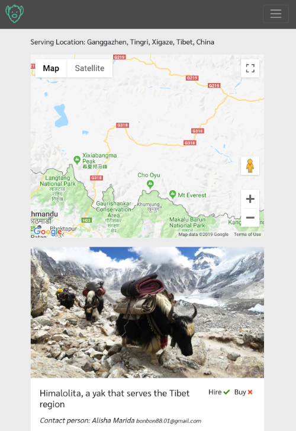
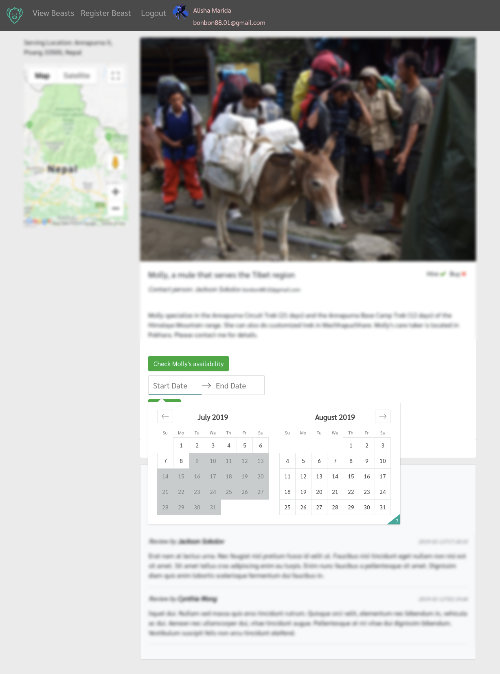
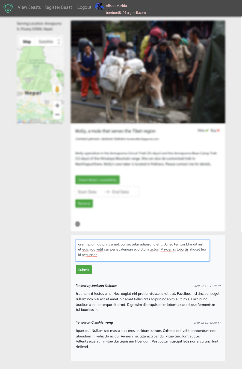

#  BeastPal
## Find a beast to carry your burden in your next wild adventure!
Cloud-source beast of burdens that are available for hire in 6 major trekking
regions: Mongolia, Andes, Tibet, Sahara, Pamir, Taklamakan

### BeastPal is currently running at https://beastpal.herokuapp.com/

## Technologies
- Front-end: [React.js](https://reactjs.org), [Redux](https://redux.js.org)
- API Server: [Node.js](https://nodejs.org), [Express.js](https://expressjs.com)
- Database: [MongoDB](https://mongodb.com)
- Module Bundler: [webpack](https://webpack.js.org/)
- Other: [Bootstrap](https://getbootstrap.com)

## Features
#### - Google Sign-in
#### - Picture upload
#### - Google map geocoding the serving location of the beast

#### - Reservation system

#### - Add beasts to the inventory
#### - View all beasts
#### - View details of 1 beast
#### - Write reviews on registered beasts

